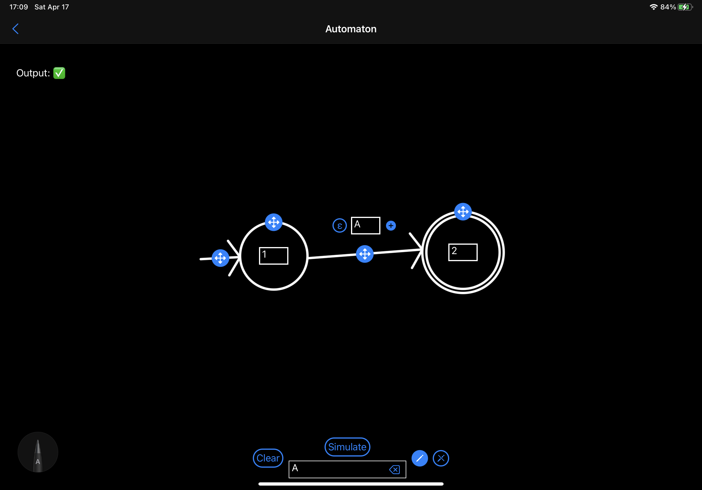

# Automata Editor

This is a repository of Automata Editor which is an iPad app for editing finite automata. It uses CoreML to recognize your strokes and let you build and test your automaton quickly.
It has been done as a part of [bachelor's thesis](https://github.com/fortmarek/bachelor-thesis). You can read more about it also in [this](https://marekfort.com/posts/automata-editor) blog post.

Any feedback and suggestions are welcome!

